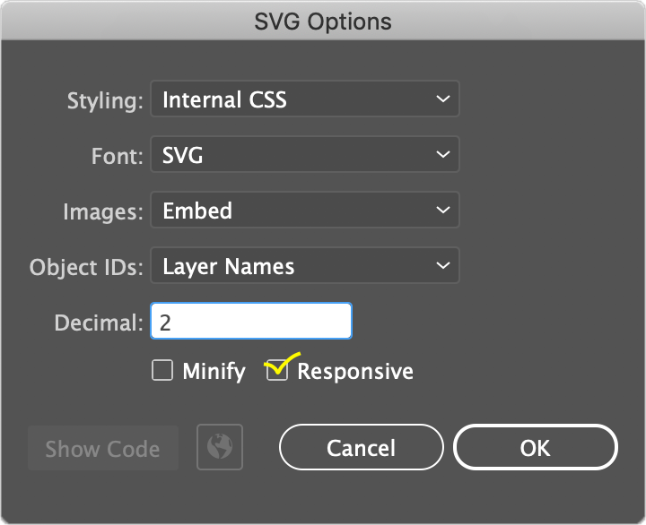
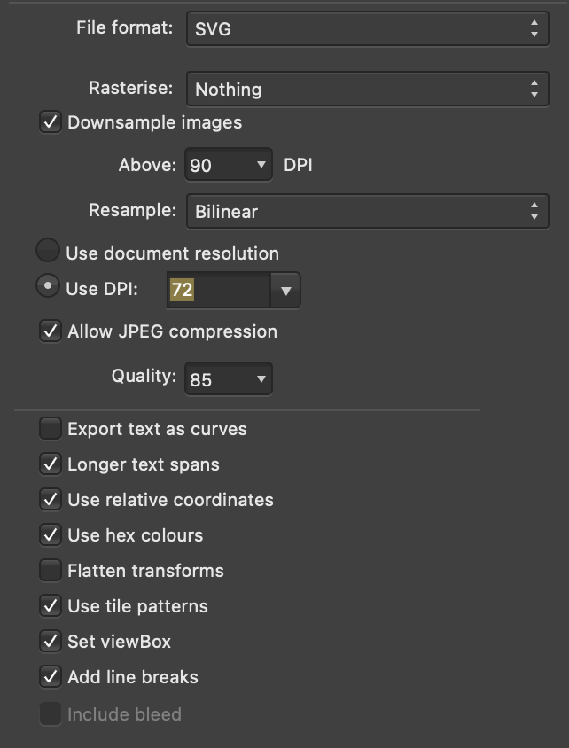

## SVG Gamepad Authoring Tips

- Wrap an empty group around any part of your svg that you want to apply css transforms to and make sure the element you wish to animate within the empty group is at relative position (0,0) and is labeled with a recognizable id. Without an empty group, any css driven transforms will overwrite the transforms applied by your vector graphics program. (eg: https://stackoverflow.com/a/70823308 & https://stackoverflow.com/a/49413393)
- Either use relative positioning on your svg elements, or use absolute positioning and set the css properties: ```transform-origin: center center; transform-box: fill-box``` on the svg elements you wish to rotate or scale. This will allow you to use css transforms based on the center of the element rather than the center of the svg. Note that this won't play nice in some browsers or with all vector program exports (especially matrix transforms).
- Make sure your tap zones (eg: around buttons or joysticks) are the only elements that are tapable / clickable, not parent elements or groups. This can be done by setting the css property ```pointer-events: all``` on the tap targets and ```pointer-events: none``` on all other SVG elements. If you don't do this, the browser default drag behaviors will not be correctly disabled on joysticks & buttons.
 - If you want to use a custom cursor, make sure to set the css property ```cursor: none``` on the svg element. This will prevent the browser from displaying the default cursor when hovering over the svg.

### Exporting SVG from Adobe Illustrator: https://www.youtube.com/watch?v=bWcweY66DL8



### Exporting SVG from Affinity designer & Affinity photo:

### Recommended [SVGO](https://github.com/svg/svgo) / [SVGOMG](https://jakearchibald.github.io/svgomg/) options:
- **Disable** `Clean IDs` to keep the `id` attributes of the SVG elements ffrom your editor
- **Disable** `Remove ViewBox` to keep the `viewBox` attribute, which makes scaling the SVG easier
- **Disable** `Remove Unknowns & Defaults` as this can remove the `id`  and `class` attributes even if `Clean IDs` is off
- **Disable** `Remove unneeded group attrs` and `collapse useless groups` if you used empty groups to alllow css transforms apply correctly to svg elements.
- **Disable** `Remove hidden elements` if you used transparent or hidden elements as touch targets or bounding boxes
- **Disable** `Merge Paths` if you used overlapping paths that should be separate elements on the gamepad, eg: touch targets for the d-pad or buttons
- **Disable** `Remove title` or `Remove desc` if the title or description is relavant for acessability
