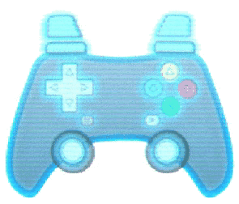

<p align="center">
  
    <!--  -->
  <h1 align="center">Virtual Gamepad Lib</h1>
</p>

[](./LICENCE)
[](https://www.typescriptlang.org/)
[](https://bundlephobia.com/result?p=virtual-gamepad-lib)
[](https://www.npmjs.com/package/virtual-gamepad-lib)
[](https://www.npmjs.com/package/virtual-gamepad-lib)

[EXAMPLES & DEMOS](https://kw-m.github.io/virtual-gamepad-lib/) | [DOCS](https://kw-m.github.io/virtual-gamepad-lib/docs/) | [GETTING STARTED](#getting-started) | [CHANGELOG](./changes.md)

All the parts needed to display and emulate interactive virtual gamepads on the web for multi-touch, mouse, keyboard, or simulated interaction.

**Features:**

- Compatible with any gamepad library or game engine or existing web games that uses the browser Gamepad API.
- Download our premade [SVG gamepads](./assets/svg/optimized/) or make your own fully unique onscreen gamepad with SVG or HTML elements.
- Display the state of any number of gamepads onscreen.
- Mock or simulate gamepads to test your game inputs repeatably in the browser.

## Modules

Each module can be used separately, but they work best together!

### [GamepadEmulator](https://kw-m.github.io/virtual-gamepad-lib/docs/modules/GamepadEmulator.html) - _[Source](./src/GamepadEmulator.ts)_

Add emulated gamepads to the browser Gamepad API. Emulated gamepads are controlled from any source - like mouse, keyboard or multiplayer game events. Use with the GamepadDisplay module for drop in multi-touch and mouse interaction.

### [GamepadDisplay](https://kw-m.github.io/virtual-gamepad-lib/docs/modules/GamepadDisplay.html) - _[Source](./src/GamepadDisplay.ts)_

Display the state of any gamepad (emulated or not) in SVG or HTML in a very customizable way.

### [GamepadApiWrapper](https://kw-m.github.io/virtual-gamepad-lib/docs/modules/GamepadApiWrapper.html) - _[Source](./src/GamepadApiWrapper.ts)_

Receive the state of any gamepad as a series of customizable events.

<br>

## Getting Started

### Installation

```bash
npm install virtual-gamepad-lib
```

### Quick Start

CSS

```css
@import ("virtual-gamepad-lib/gamepad_assets/base.css");
```

JS

```JS
import { setupPresetInteractiveGamepad } from "virtual-gamepad-lib/helpers";

// Import the svg source code for the full on-screen gamepad SVG
import FULL_GPAD_SVG_SOURCE_CODE from "virtual-gamepad-lib/gamepad_assets/rounded/display-gamepad-full.svg?raw";
//  - this could be done like with a build tool like vite(shown here) or webpack or at runtime with a fetch request

// Get the HTML container that the onscreen gamepad will go in.
const GPAD_DISPLAY_CONTAINER = document.getElementById("gpad_display_container");

// Insert the SVG contents for the onscreen gamepad into the DOM
GPAD_DISPLAY_CONTAINER.innerHTML = LEFT_GPAD_SVG_SOURCE_CODE;

// Setup the onscreen gamepad to react to the state of the emulated gamepad.
const { gpadApiWrapper, gpadDisplay, gpadEmulator } = setupPresetInteractiveGamepad(GPAD_DISPLAY_CONTAINER, {
    /* Options: see interactiveGamepadPresetConfig type in helpers.ts */
});
```

### Importing Modules

```typescript
import { GamepadApiWrapper, GamepadEmulator, GamepadDisplay } from "virtual-gamepad-lib";

// Typescript types are included
import type { GamepadApiWrapper, wrapperConfig /* etc. */ } from "virtual-gamepad-lib";

// Individual modules can be imported like this:
import { GamepadEmulator } from "virtual-gamepad-lib/GamepadEmulator";

// Common.js style also works:
const { GamepadApiWrapper /* etc. */ } = require("virtual-gamepad-lib");
```

See [IMPORTING_GUIDE.md](IMPORTING_GUIDE.md) for help.

### Examples

See the [code examples](./examples)
which are live demos at [kw-m.github.io/virtual-gamepad-lib](https://kw-m.github.io/virtual-gamepad-lib/)

### Using on-screen gamepads in your app

- SVG or HTML/CSS gamepads must go **_inline_** in your website HTML.

  - **SVG:** Either manually copy paste the contents of the SVG into your HTML or add the full SVG contents to the page using your framework of choice at build time or runtime.
    <details>
      <summary><b>Example build time import of SVG with vite & js/svelte/vue/react</b></summary>

    ```js
    // 1. Get the full source of the svg:
    import GAMEPAD_SVG = "virtual-gamepad-lib/premade-gamepads/full.svg?raw"

    // 2. Add the full svg to your webpage html:

    /* Vanilla JS */
    document.body.getElementById("MY_GAMEPAD_CONTAINER").innerHTML = GAMEPAD_SVG;

    /* Svelte */
    <div id="MY_GAMEPAD_CONTAINER" />{@html GAMEPAD_SVG}</div>

    /* Vue */
    <div id="MY_GAMEPAD_CONTAINER" v-html="GAMEPAD_SVG"></div>

    /* React  */
    <div id="MY_GAMEPAD_CONTAINER" dangerouslySetInnerHTML={createMarkup(GAMEPAD_SVG)} />

    // All the above examples are safe from XSS attacks since the gamepad svg is not user-generated & the svg source is included at build time.
    ```

    </details>
    <br>

  - **HTML/CSS:** Write as you would any other part of your page, make sure to add IDs to every button and joystick to reference later!

- We have example vector gamepads in the [gamepad_asset_originals](gamepad_asset_originals) folder:

  - [Affinity Suite](gamepad_asset_originals/Affinity/) (original design)
  - [Adobe Creative Suite](gamepad_asset_originals/Adobe/) (converted to psd & pdf)
  - [SVG](gamepad_asset_originals/svg/) (Best for importing into vector graphics programs)

MAKE SURE TO FOLLOW THE [SVG Authoring Guide](#svg-authoring-guide) IF YOU WANT TO MAKE YOUR OWN VECTOR GAMEPAD!

<br/>

## SVG Authoring Guide

**Making custom SVG gamepads for display on the web is tricky, there are rules that need to be followed to get a good result!**

- In your vector graphics program, name your layers with this format: `#svgElementId` or `#svgElementId.svgElementClass` to make it easier to split the id and class attributes in the exported svg with our automated SVGO config.
- Use the export option **flatten transforms** or **use absolute positioning** in your vector graphics program **AND** wrap a group around any part of your svg that you want to more or apply css transforms to (such as joysticks) and make sure the element you wish to animate within the empty group is labeled with a recognizable id. Without an empty group, any css driven transforms may overwrite the transforms applied by your vector graphics program - see [this question](https://stackoverflow.com/a/70823308) and [this solution](https://stackoverflow.com/a/49413393).
- Use the centerTransformOrigin() function from [virtual-gamepad-lib/utilities](./src/utilities.ts) on all elements you wish to rotate or scale using css. This will allow you to use css transforms based on the center of the element rather than the center of the svg.
  - Alternatively set the css properties: `transform-origin: center center; transform-box: fill-box` on these svg elements; Note that this won't play nice in some browsers or with all vector program exports (especially matrix transforms).
- Make Tap zones for each button or joystick that are larger than the button/joystick for fat touchscreen fingers!

  - Tap zones must be single paths, not nested groups with child elements.
  - Make sure to have ids & classes on your tap targets (use the handy naming scheme `#id.gpad-tap-target` in your vector graphics program).
  - The default CSS disables pointer events on everything in your svg except the tap target. If you use a custom css class you'll need to do this yourself.

    ```css
    /* example css to disable touches/clicks on everything but the tap targets */
    svg.my-gamepad-svg *:not(.gpad-tap-target) {
      pointer-events: none;
    }
    ```

- If you want to use a custom cursor, make sure to set the css property `cursor: none` on the svg tap elements. This will prevent the browser from displaying the default cursor when hovering over the svg.

### Exporting SVG from Adobe Illustrator:

See: [https://www.youtube.com/watch?v=bWcweY66DL8](https://www.youtube.com/watch?v=bWcweY66DL8)


### Exporting SVG from Affinity Designer & Affinity Photo:


### Process with [SVGO](https://github.com/svg/svgo) (REQUIRED):

**Auto** (_recommened_)

Use the pre-configured SVGO config included in this package. It will optimize the svgs while retaining compatiblity with css & js interaction and avoid id collisions. Use the config with the SVGO CLI. The config file is located at: [svgo.config.js](./svgo.config.js)

1. Install SVGO `npm install svgo`
2. Create a `svgo.config.js` file in the root of your project with the contents:

   ```js
   import svgoConfig from "virtual-gamepad-lib/svgo.config.js";
   // modify svgoConfig here if desired
   export default svgoConfig;
   ```

3. Add an NPM script to your package.json:

   ```json
   {
     "scripts": {
       "optimize_svgs": "svgo --recursive --folder ./path/to/your/original/svgs/ --output ./folder/to/put/optimized/svgs/"
     }
   }
   ```

4. run it `npm run optimize_svgs`

**Manual** (_NOT recommened_)

- This method will not avoid ID collisions between SVGs on a page like the automatic method above does
- **Disable** `Clean IDs` to keep the `id` attributes of the SVG elements from your editor
- **Disable** `Remove ViewBox` to keep the `viewBox` attribute, which makes scaling the SVG easier
- **Disable** `Remove Unknowns & Defaults` as this can remove the `id` and `class` attributes even if `Clean IDs` is off
- **Disable** `Remove unneeded group attrs` and `collapse useless groups` if you used empty groups to alllow css transforms apply correctly to svg elements.
- **Disable** `Remove hidden elements` if you used transparent or hidden elements as touch targets or bounding boxes
- **Disable** `Merge Paths` if you used overlapping paths that should be separate elements on the gamepad, eg: touch targets for the d-pad or buttons
- **Disable** `Remove title` or `Remove desc` if the title or description is relavant for acessability

If you format your layer names in the format `elementId.elementClass`, you can use the following regular expression to extract the elementId and elementClass from the layer name (The pre-configured SVGO config has a improved version of this inbuilt, but you can do this manually with find and replace):

**Example:**

```html
<path id="right_highlight.gpad-highlight" />
becomes
<path id="right_highlight" class="gpad-highlight" />
```

**Find (Regex):**

```perl
/id="([^"\.]*)(?:"|(?:.([^"\.]*)"))/g
```

**Replace:**

```perl
id="$1" class="$2"
```

## Contributing

Contributions are welcome!
This project is still in early development, so there are many ways to contribute.

- [Report bugs](https://github.com/KW-M/virtual-gamepad-lib/issues) - If you find a bug, please report it in the issues section.
- [Contribute Documentation](https://github.com/KW-M/virtual-gamepad-lib/)
  - Checkout a fork of the project and run `npm run watch:docs` to view the docs locally, then edit comments in the source code or README and submit a pull request!
- [Contribute Code](https://github.com/KW-M/virtual-gamepad-lib/)
  - This project uses PNPM for package management, so download a copy first. Or use NPM or Yarn if you prefer, just replace PNPM with NPM or YARN when running the scripts in package.json. (eg: `pnpm run build` becomes `npm run build`)
  - Checkout a fork of the project, add new features or bugfixes. Run `pnpm run examples:watch` to check the examples are working locally. Run `pnpm run pub-preview` to build and test the library, examples and docs, then submit a pull request - Thank You!

NPM / PNPM / Yarn scripts:

- test - Test the library
- build - Build the library
- build:docs - Build the documentation
- svg:optimize - Run SVGO on the SVGs in the [gamepad_asset_originals/svg](./gamepad_asset_originals/svg/) folder and puts them in [gamepad_assets](./gamepad_assets/)
- examples:watch - Start a dev server for viewing the examples with live updates
- examples:build - Build/compile the examples - Will also precompile the TS example code to JS for folks who don't use typescript
- examples:preview - View the compiled/built examples after running "examples:build"
- pub - run all checks and publish this package to npm
- pub-preview - run all checks without actually publishing to npm
